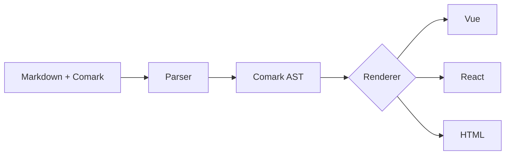

## What is Comark?

**Comark** stands for [**Co**]{.text-primary}mponents in [**Mark**]{.text-primary}down. It's an extension of the Markdown syntax that lets you use components directly inside your Markdown content:

```mdc
# Welcome to my blog

This is regular **markdown** with a custom component:

::alert{type="warning"}
This is an important message!
::
```

The `::alert` is a block component that supports properties and children (also known as slots).

::tip{to="/kb/why-comark"}
Learn why we created Comark and the principles behind its design in [Why Comark](https://github.com/kb/why-comark).
::

Comark parses this into an [AST](https://en.wikipedia.org/wiki/Abstract_syntax_tree) that can be rendered to [HTML](/rendering/html). It also supports rendering to [Vue](/rendering/vue), [Nuxt](/rendering/nuxt), [React](/rendering/react), and [Svelte](/rendering/svelte), turning your Markdown into fully interactive content.

::code-group

```vue [Nuxt]
<template>
  <Comark :components="{ Alert }">{{ content }}</Comark>
</template>

<script setup lang="ts">
import Alert from './Alert.vue'

const content = `
# Hello World

::alert{type="info"}
Welcome to Comark!
::
`
</script>
```

```vue [Vue]
<script setup lang="ts">
import { Comark } from '@comark/vue'
import Alert from './Alert.vue'

const content = `
# Hello World

::alert{type="info"}
Welcome to Comark!
::
`
</script>

<template>
  <Comark :components="{ Alert }">{{ content }}</Comark>
</template>
```

```tsx [React]
import { Comark } from '@comark/react'
import Alert from './Alert.tsx'

const content = `
# Hello World

::alert{type="info"}
Welcome to Comark!
::
`

export default function App() {
  return <Comark components={{ Alert }}>{content}</Comark>
}
```

```svelte [Svelte]
<script lang="ts">
  import { Comark } from '@comark/svelte'
  import Alert from './Alert.svelte'

  const content = `
# Hello World

::alert{type="info"}
Welcome to Comark!
::
`
</script>

<Comark markdown={content} components={{ alert: Alert }} />
```

```ts [HTML]
import { parse } from 'comark'
import { renderHTML } from '@comark/html'

const tree = await parse(`
# Hello World

::alert{type="info"}
Welcome to Comark!
::
`)

const html = await renderHTML(tree, {
  components: {
    alert: async ([_tag, attrs, ...children], { render }) => {
      return `<div class="alert alert-${attrs.type}" role="alert">${await render(children)}</div>`
    }
  }
})
/*
<h1>Hello World</h1>
<div class="alert alert-info" role="alert"><p>Welcome to Comark!</p></div>
*/
```
::

## When to Use Comark

Comark is ideal for:

- **Documentation sites** - Write docs in Markdown with interactive examples
- **Blog platforms** - Rich content with custom components for callouts, embeds, and more
- **AI chat interfaces** - Stream and render Markdown responses in real-time
- **CMS integrations** - Let content editors use components without touching code
- **Technical writing** - Combine prose with live code examples and diagrams

## Comparison with Other Tools

| Feature | Comark | Streamdown | MDX | Markdoc |
|---------|--------|------------|-----|---------|
| Streaming support | :icon{name="i-lucide-check" class="text-green-500"} | :icon{name="i-lucide-check" class="text-green-500"} | :icon{name="i-lucide-x" class="text-red-500"} | :icon{name="i-lucide-x" class="text-red-500"} |
| Component syntax | :icon{name="i-lucide-check" class="text-green-500"} | :icon{name="i-lucide-x" class="text-red-500"} | :icon{name="i-lucide-check" class="text-green-500"} | :icon{name="i-lucide-check" class="text-green-500"} |
| Vue support | :icon{name="i-lucide-check" class="text-green-500"} | :icon{name="i-lucide-x" class="text-red-500"} | :icon{name="i-lucide-x" class="text-red-500"} | :icon{name="i-lucide-check" class="text-green-500"} |
| React support | :icon{name="i-lucide-check" class="text-green-500"} | :icon{name="i-lucide-check" class="text-green-500"} | :icon{name="i-lucide-check" class="text-green-500"} | :icon{name="i-lucide-check" class="text-green-500"} |
| No build step | :icon{name="i-lucide-check" class="text-green-500"} | :icon{name="i-lucide-check" class="text-green-500"} | :icon{name="i-lucide-x" class="text-red-500"} | :icon{name="i-lucide-check" class="text-green-500"} |
| Parse to AST | :icon{name="i-lucide-check" class="text-green-500"} | :icon{name="i-lucide-x" class="text-red-500"} | :icon{name="i-lucide-x" class="text-red-500"} | :icon{name="i-lucide-check" class="text-green-500"} |
| Compact AST | :icon{name="i-lucide-check" class="text-green-500"} | :icon{name="i-lucide-x" class="text-red-500"} | :icon{name="i-lucide-x" class="text-red-500"} | :icon{name="i-lucide-x" class="text-red-500"} |
| Auto-close for streams | :icon{name="i-lucide-check" class="text-green-500"} | :icon{name="i-lucide-check" class="text-green-500"} | :icon{name="i-lucide-x" class="text-red-500"} | :icon{name="i-lucide-x" class="text-red-500"} |
| Decoupled parsing & rendering | :icon{name="i-lucide-check" class="text-green-500"} | :icon{name="i-lucide-x" class="text-red-500"} | :icon{name="i-lucide-x" class="text-red-500"} | :icon{name="i-lucide-check" class="text-green-500"} |

## Key Features

::card-group
#default
  ::card{icon="i-lucide-zap" title="Fast Parsing" to="/api/parse"}
  Optimized parser that handles large documents efficiently with minimal memory usage.
  ::

  ::card{icon="i-lucide-component" title="Component Syntax" to="/syntax/components"}
  Embed custom components in Markdown with props, slots, and nested children.
  ::

  ::card{icon="i-lucide-radio" title="Streaming Support" to="/rendering/vue#streaming"}
  Real-time incremental parsing for AI chat interfaces and live content.
  ::

  ::card{icon="i-lucide-code" title="Framework Agnostic" to="/rendering/vue"}
  First-class support for both Vue and React with dedicated renderers.
  ::

  ::card{icon="i-lucide-palette" title="Syntax Highlighting" to="/plugins/built-in/syntax-highlight"}
  Built-in Shiki integration for beautiful code blocks with theme support.
  ::

  ::card{icon="i-lucide-file-text" title="GFM Support" to="/syntax/markdown"}
  Full GitHub Flavored Markdown support including tables, task lists, and more.
  ::
::

## How It Works

::div{.border .border-default .rounded .bg-muted .p-4}

::

1. **Parse** - Comark parses your content into a compact [Comark AST](/syntax/comark-ast)
2. **Transform** - The AST can be manipulated, cached, or serialized
3. **Render** - Framework-specific renderers convert the AST to Vue or React components
