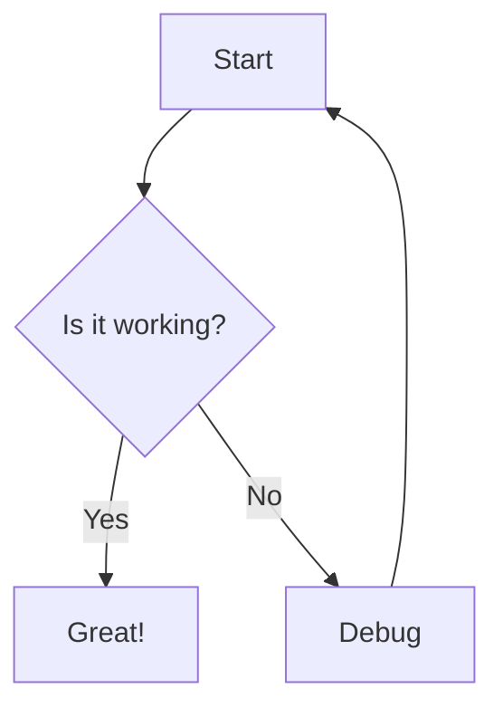
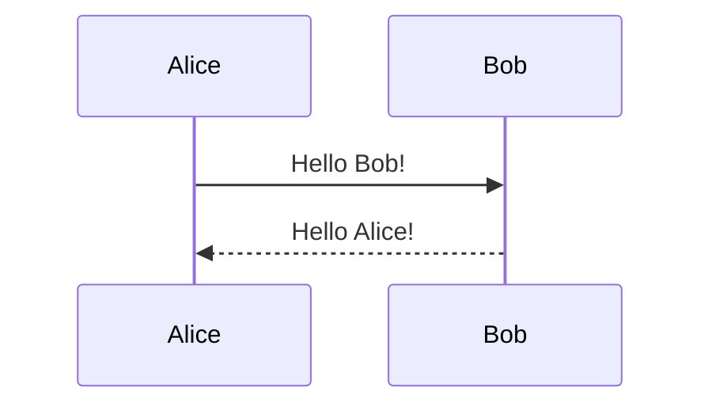
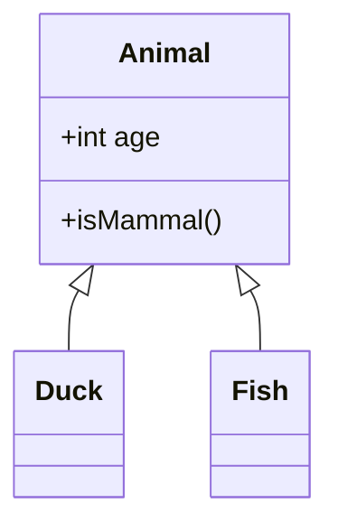
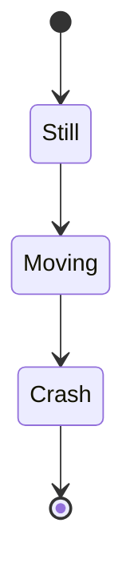
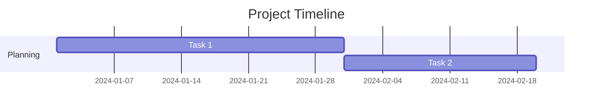
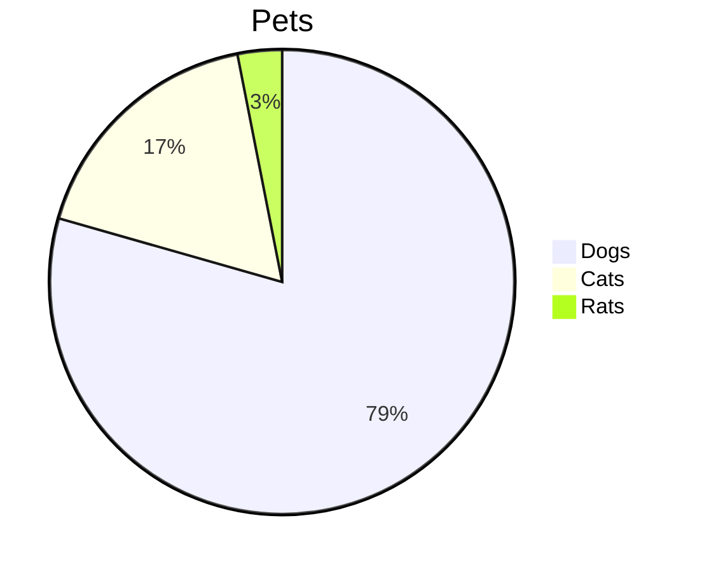
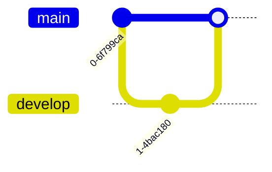
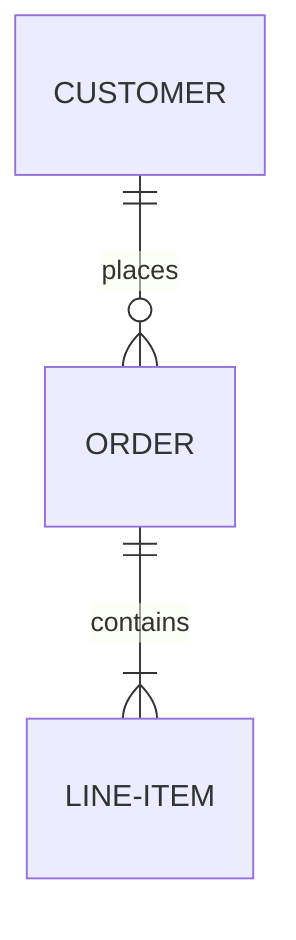

The `comark/plugins/mermaid` plugin renders [Mermaid](https://mermaid.js.org/) diagrams from ` ```mermaid ` code blocks. Diagrams are rendered client-side via the `<Mermaid>` component exported alongside the plugin.

::note
[`beautiful-mermaid`](https://github.com/lukilabs/beautiful-mermaid) is a peer dependency — install it alongside Comark: `npm install beautiful-mermaid`
::

## Usage

```typescript
import { parse } from 'comark'
import mermaid from 'comark/plugins/mermaid'

const result = await parse(content, {
  plugins: [mermaid()]
})
```

With framework components — pass both the plugin and the `Mermaid` renderer component:

::code-group

```vue [Vue]
<script setup lang="ts">
import { Comark } from '@comark/vue'
import mermaid, { Mermaid } from '@comark/vue/plugins/mermaid'
</script>

<template>
  <Suspense>
    <Comark
      :components="{ mermaid: Mermaid }"
      :plugins="[mermaid()]"
    >{{ content }}</Comark>
  </Suspense>
</template>
```

```tsx [React]
import { Comark } from '@comark/react'
import mermaid, { Mermaid } from '@comark/react/plugins/mermaid'

<Comark
  components={{ mermaid: Mermaid }}
  plugins={[mermaid()]}
>
  {content}
</Comark>
```

```svelte [Svelte]
<script lang="ts">
  import { Comark } from '@comark/svelte'
  import mermaid, { Mermaid } from '@comark/svelte/plugins/mermaid'
</script>

<Comark {content} components={{ mermaid: Mermaid }} plugins={[mermaid()]} />
```

::

---

## Features

### Diagram Types

Mermaid supports a wide range of diagram types:

**Flowchart**

````markdown

````

**Sequence Diagram**

````markdown

````

**Class Diagram**

````markdown

````

**State Diagram**

````markdown

````

**Gantt Chart**

````markdown

````

**Pie Chart**

````markdown

````

**Git Graph**

````markdown

````

**ER Diagram**

````markdown

````

See the [Mermaid documentation →](https://mermaid.js.org/intro/) for full syntax reference on each diagram type.

### Code Block Attributes

Pass component props directly on the opening fence:

````markdown

````

---

## API

### `mermaid()`

Returns a `ComarkPlugin` that marks ` ```mermaid ` code blocks for custom rendering. Takes no options.

**Returns:** `ComarkPlugin`

The plugin converts mermaid code blocks into AST nodes that the `<Mermaid>` component renders. Rendering requires passing `Mermaid` to the `components` prop of `<Comark>` — see [Usage](#usage).

---

## Component Props

Props accepted by the `<Mermaid>` component:

| Prop | Type | Default | Description |
|---|---|---|---|
| `content` | `string` | required | The Mermaid diagram source |
| `theme` | `string` | `'default'` | Mermaid theme — see [available themes](https://github.com/lukilabs/beautiful-mermaid#built-in-themes) |
| `themeDark` | `string` | `undefined` | Theme to use in dark mode |
| `width` | `string` | `'100%'` | Container width |
| `height` | `string` | `'auto'` | Container height |
| `class` | `string` | `''` | CSS classes for the container |

---

## Examples

::card{icon="i-simple-icons-mermaid" title="Vue + Vite Mermaid" to="/examples/plugins/vue-vite-mermaid"}
Complete working implementation with multiple diagram types.
::
